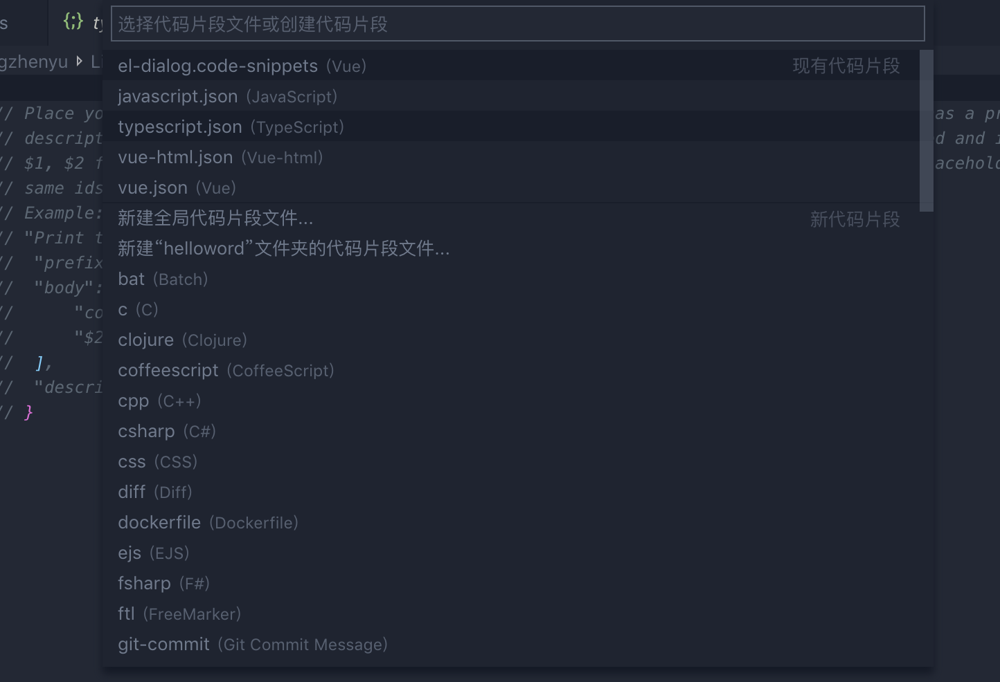

## 让我们搬砖的速度更快一些--开发自己的VScode插件
作为一个前端开发，日常开发中我们最常接触的东西有三类
* 浏览器
* 编辑器
* 其他辅助软件

所以在思考码字效率的时候，也主要集中在这几类上，本文给大家介绍的是编辑器->VScode插件相关
#### 快速搬砖的几种方法
不同的团队、不同的业务里面，总有很多特殊的，个性化的设计，所以我们的代码里面总会有许多相似但却不太一样的代码。一般来说我们常用的减少或者快速写出这种代码的方法有这么几种

* 封装抽象组件
* 利用脚本跟模板生成文件
* 复制粘贴然后修改

##### 封装抽象组件
一般我们常用的封装组件，基本上是以element-ui为代表的组件库，以及我们自己封装的一些业务组件。

* 优点：逻辑更加清晰，通常可以将复杂的逻辑对外隐藏，而且可以减少最终实际的代码量
* 缺点：业务复杂多变的情况下，扩展性不强的组件往往难以适应业务变化，导致要么重新弄了一套，要么魔改之后组件维护性变差

##### 利用脚本跟模板生成文件
利用脚本跟模板生成文件通常结合了一些命令行工具和模板生成器，还有类似gulp的工具可以批量顺序执行多个命令，简化流程操作

* 优点： 可以处理复杂的工作，模板具有更高的可扩展性，可以随意添加自定义的东西
* 缺点： 编写脚本较为复杂，需要去终端执行命令（这个步骤个人感觉比较麻烦），更擅长执行文件级别的任务

##### 复制粘贴修改
简单粗暴的骚操作~
* 优点：快
* 缺点：大量冗余的代码难以清除，不熟悉之前的代码修改小心翼翼，未删除的无用代码可能导致一些bug

##### 还有其他方法吗？
有，那就是我们天天用snippet，vscode插件商店里面有很多snippet插件，提供了许多快捷提示的代码片段，可以让我们快速的写出我们要的文件，我们常用snippet大致有几类：

* js，ts等语言相关
* vue，react等框架相关提示
* element-ui等UI组件库的代码片段提示

#### 自定义的snippet
商店里提供的snippet往往是比较通用的提示插件，只提供了一些基本的代码片段

* js，ts等语言相关 --> 基本的语法提示，方法提示补全
* vue，react等框架相关提示 --> 基本的框架相关语法，指令的提示补全
* element-ui等UI组件库的代码片段提示 --> 相关组件的快捷输出

日常手工开发这些插件基本满足了，但是具体到业务里面，我们往往还需要大量的人工手动书写。

**怎么继续偷懒呢？**
这时候我们可以使用VScode的用户代码片段功能


如上图我们可以从以上路径找到用户代码片段的编辑入口
选择之后会出现一个选择代码片段文件你的下拉列表

我们常用的大致上有：

| 文件名 | 适用范围 |
| --- | --- |
| javascript.json | js文件、vue文件中的script脚本 |
| typescript.json | ts、vue文件中的ts脚本 |
| css.json | css文件 |
| vue.json | vue文件没有用template、script、style包起来的部分，可以用来生成template、script、style区域 |
| vue-html.json | vue文件中template部分 |

##### 代码片段的编写语法
代码片段是一个json文件，他有一些特定的语法以一个单文件组件的自定义片段为例：
``` js
{
	"Print to vue": { // 代码片段名字
		"prefix": "vue", // 实际使用时的前缀，即使用什么来唤起这段代码片段
		"body": [ // 代码片段的内容区域，是一个数组，实际代码的每一行对应数组中的一个
			"<template>",
			"\t<div>", // \t表示一个制表符缩进，双引号，换行都需要转义字符
			"$1", // $1,$2表示代码片段生成之后的光标位置，可以使用tab键按照顺序切换
			"\t</div>", // ${1:label} 光标会选中label字符串
			"</template>", // 注意$字符需要写成$$比如$emit方法，需要写成$$emit()
			"<script>",
			"/**",
			" * @note",
			" * @author chengzhenyu@corp.netease.com",
			" * @date 代码片段生成",
			" * @Last Modified by: chengzhenyu@corp.netease.com",
			" * @Last Modified time: 2019-07-11 16:59:17",
			" */",
			"export default {",
			"\tdata() {",
			"\t\treturn {",
			"\t\t\t$2",
			"\t\t}",
			"\t},",
			"\tmethods: {",
			"\t\t$3",
			"\t},",
			"}",
			"</script>",
		],
		"description": "Vue单文件组件"
	},
}
```

一些成品示例：

* dialog
* elpa
* pagi
* pagi-data

### 编写VScode插件~
自定义的snippet对于个人来说，可以提升一定的效率，但是团队共享起来就比较麻烦，这时候我们可以利用VScode插件将这些集合起来，

#### 起步

* STEP1：安装Yeoman：`npm install -g yo`
* STPP2：安装VS Code Extension Generator: `npm install -g yo generator-code`
* STEP3：执行`yo code`，按照提示初始化工程

我们按照以上步骤创建一个基础的HelloWorld工程
``` bash
# ? What type of extension do you want to create? New Extension (TypeScript)
# ? What's the name of your extension? HelloWorld
### Press <Enter> to choose default for all options below ###

# ? What's the identifier of your extension? helloworld
# ? What's the description of your extension? LEAVE BLANK
# ? Initialize a git repository? Yes
# ? Which package manager to use? npm
```
##### 运行&调试

[运行](https://code.visualstudio.com/api/get-started/your-first-extension/launch.mp4)
[调试](https://code.visualstudio.com/api/get-started/your-first-extension/debug.mp4)
##### 文件结构
``` shell
.
├── .vscode
│   ├── launch.json     // Config for launching and debugging the extension
│   └── tasks.json      // Config for build task that compiles TypeScript
├── .gitignore          // Ignore build output and node_modules
├── README.md           // Readable description of your extension's functionality
├── src
│   └── extension.ts    // Extension source code
├── package.json        // Extension manifest
├── tsconfig.json       // TypeScript configuration
```
###### package.json
除了基本的npm中package.json中的字段，vscode插件工程中还有一些特定的字段

* `name`和`publisher`：VS Code `<publisher>.<name>`用作扩展的唯一ID
* `contributes`：一组贡献点声明：[具体类别列表](https://code.visualstudio.com/api/references/contribution-points#contributes.commands)
* `activationEvents`：一组激活事件的声明：[具体事件列表](https://code.visualstudio.com/api/references/activation-events)，例如：onCommand，在
* `engines.vscode`：这指定扩展所依赖的VS Code API的最低版本。

其中`contributes`与`activationEvents`较为重要，已`helloworld`中的`commands`为例：

```json
{
    "contributes": {
        "commands": [{
            "command": "extension.helloWorld",
            "title": "Hello World",
            "category": "Hello"
        }]
    }
}
```
其中：

* command：要注册的命令名
* title：在命令面板显示的的名称
* category：命令的简单分类

当调用命令时（从命令选项板、任何其他菜单、或以编程方式），VS代码将发出一个activationEvent：`onCommand:${command}`。
##### contributes

* configuration：提供配置项：首选项->设置当中
* commands：默认在命令选项板，可包含标题与图标(命令选项板中不展示)
* menus：提供菜单选项，包括：[菜单](https://code.visualstudio.com/api/references/contribution-points#contributes.menus)
    * 编辑器上下文菜单 - editor/context
    * 编辑标题菜单栏 - editor/title
    * 资源管理器邮件菜单 - explorer/context
    * 编辑器标题上下文菜单 - editor/title/context，etc.
   
* keybindings：快捷键
* languages：引入一种新语言或丰富VS Code对语言的认知
* debuggers：贡献调调试器
* breakpoints：将启用设置断点的语言文件类型
* grammars：提供一种与语言相关的语法信息
* themes：主题
* snippets：提供代码片段提示，与语言相关联
* jsonValidation：为特定类型的json文件提供验证模式，例如babelrc之类的文件
* views：为VS代码提供视图
* viewsContainers：提供自定义视图的视图容器
* problemMatchers：问题匹配器模式
* problemPatterns：提供可在问题匹配器中使用的命名问题模式
* taskDefinitions：提供任务定义
* colors: 颜色
* typescriptServerPlugins：增强VS Code的JavaScript和TypeScript支持的TypeScript服务器插件

##### extension.ts
extension.ts文件导出两个函数：activate和deactivate。

* activate：注册的激活事件发生时执行，也是我们扩展代码的主要入口我们可以在此注册事件，执行操作等
* deactivate：扩展停用之前执行
#### 使用webpack
可以使用webpack打包vscode工程
主要配置
```js
{
  target: 'node', 
  entry: './src/extension.ts',
  output: {
    path: path.resolve(__dirname, 'dist'),
    filename: 'extension.js',
    libraryTarget: 'commonjs2',
    devtoolModuleFilenameTemplate: '../[resource-path]'
  },
  devtool: 'source-map',
  externals: {
    vscode: 'commonjs vscode
  }
}
```
package.json中
```json
{
    "main": "./dist/extension.js",
    "scripts": {
        "vscode:prepublish": "webpack --mode production",
        "compile": "webpack --mode none",
        "watch": "webpack --mode none --watch",
        "test-compile": "tsc -p ./",
    },
}
```
#### 扩展类型
扩展类型主要与contributes相对应，大体划分为以下几种

* 主题外观
* 程序语言相关
* 工作台相关
* 调试相关

这里有一官方的不同类型插件的demo列表：[DEMO](https://code.visualstudio.com/api/extension-guides/overview)

下面主要介绍其中几种类扩展的编写

##### Snippet扩展插件
首先当然是前文提到的Snippet插件，Snippet插件超级简单

首先编写字节的用户代码片段，将自己满意的片段按照语言分别独立写在不同的json文件当中，灾后编辑`package.json`文件即可：
```json
{
  "contributes": {
    "snippets": [
      {
        "language": "javascript",
        "path": "./snippets.json"
      }
    ]
  }
}
```
当然你也可以使用`yo code`，然后选择`New Code Snippets`来直接生成一个Snippets插件示例然后修改。

我们来修改`Hello World`插件增加一段Snippet试试~

**此处代码演示~**
##### 语法高亮扩展插件
语法高亮较为复杂，他有两个组件：

* 使用语法将文本分解为tokens与scopes的列表
* 然后使用主题将这些范围映射到特定的颜色和样式

我们这里只讨论第一部分，主题部分暂时不讨论

VSCode使用TextMate语法将程序文本拆解为tokens与scopes，TextMate语法可以参考这里：[TextMate](https://macromates.com/manual/en/language_grammars)

* Tokens：指的是一个代码结构基本元素，跟解析AST时的Tokens含义基本一致
* Scopes：指的是一个Token所关联的上下文信息

###### 创建一个基本的语法插件
使用`yo code`，然后选择`New Language`来直接生成一个语法插件模板然后修改。

我们直接在HelloWorld插件当中添加
```json
{
  "contributes": {
    "languages": [{
        "id": "pop",
        "extensions": [".pop"]
    }],
    "grammars": [{
        "language": "pop",
        "scopeName": "source.pop",
        "path": "./syntaxes/pop.tmGrammar.json"
    }]
  }
}
```
以下为测试代码片段
```js
a
(
    b
)
x
(
    (
        c
        xyz
    )
)
(
a
```
然后在`pop.tmGrammar.json`当中定义我们的语法规则：
```json
{
    "scopeName": "source.pop",
    "patterns": [{
        "include": "#expression"
    }],
    "repository": {
        "expression": {
            "patterns": [{
                "include": "#letter"
            }, {
                "include": "#paren-expression"
            }]
        },
        "letter": {
            "match": "a|b|c",
            "name": "keyword.letter"
        },
        "paren-expression": {
            "begin": "\\(",
            "end": "\\)",
            "beginCaptures": {
                "0": {
                    "name": "punctuation.paren.open"
                }
            },
            "endCaptures": {
                "0": {
                    "name": "punctuation.paren.close"
                }
            },
            "name": "expression.group",
            "patterns": [{
                "include": "#expression"
            }]
        }
    }
}
```
语法文件本身由顶级规则组成，通常包括

* patterns：列出顶级元素
* repository：定义每个元素

语法中的其他规则可以引用repository使用中的元素`{ "include": "#id" }`。

语法解析之后示例语法生成以下范围（从最特定到最不具体的范围从左到右列出）：
```
a               keyword.letter, source.pop
(               punctuation.paren.open, expression.group, source.pop
    b           keyword.letter, expression.group, source.pop
)               punctuation.paren.close, expression.group, source.pop
x               source.abc
(               punctuation.paren.open, expression.group, source.pop
    (           punctuation.paren.open, expression.group, expression.group, source.pop
        c       keyword.letter, expression.group, expression.group, source.pop
        xyz     expression.group, expression.group, source.pop
    )           punctuation.paren.close, expression.group, expression.group, source.pop
)               punctuation.paren.close, expression.group, source.pop
(               source.pop
a               keyword.letter, source.pop
```
示例pop语法将字母abc作为关键字和parens的嵌套标记为表达式，解析出来的scope类似于函数对战，越靠左的优先级越高，
我们在这只当中搜索`editor.tokenColorCustomizations`参数，没有的话新增一个：
```json
{
    "editor.tokenColorCustomizations": {
        "textMateRules": [
            {
                "name": "keyword.letter",
                "scope": "keyword.letter",
                "settings": {
                    "foreground": "#FF0000",
                    "fontStyle": "bold"
                }
            },
            {
                "name": "punctuation.paren.open",
                "scope": "punctuation.paren.open",
                "settings": {
                    "foreground": "#1c0ee7",
                    "fontStyle": "bold"
                }
            },
            {
                "name": "source.pop",
                "scope": "source.pop",
                "settings": {
                    "foreground": "#000",
                    "fontStyle": "bold"
                }
            },
        ]
    }
}
```
自定义的语法规则高亮主要依靠`textMateRules`字段进行自定义配置，当然这些也可以集成在主题插件当中。

我们可以看到修改之后的test.pop文件的效果，其中没有配置的部分，默认使用了最顶级`scope`的规则
###### scope检查器
为方便调试语法文件，VScode提供了语法检查器，在命令面板中输入指令，即可开启
```shell
Developer: Inspect TM Scopes
```


###### 注入语法
利用注入语法，可以将语法注入到已有的语言的语法scope中
```js
{
    "path": "./syntaxes/injection.json",
    "scopeName": "test-comment.injection",
    "injectTo": ["source.js","source.vue"] //要注入的目的scope
}
```
我们在`grammars`中添加以上语法，与普通的新语言特性不同的是，没有指定`language`，而是`injectTo`，`injectTo`是一个`scope`的数组，我们来高亮一下注释后的`test`字段


```js
{
    "scopeName": "test-comment.injection",
    "injectionSelector": "L:comment.line.double-slash",// L:指放在scope的最左边也就是优先级最高，后面指的是要注入的末级scope
    "patterns": [
      {
        "include": "#test-keyword"
      }
    ],
    "repository": {
      "test-keyword": {
        "match": "test",
        "name": "keyword.test"
      }
    }
  }
```
###### 程序语言功能
程序化语言功能是一组由`vscode.languages.*API` 提供支持的智能编辑功能
具体API查阅：[(API)](https://code.visualstudio.com/api/language-extensions/programmatic-language-features#show-all-symbol-definitions-in-folder)

###### 以`registerHoverProvider`以及`registerCompletionItemProvider`为例:
**registerHoverProvider**

`vscode.languages.registerHoverProviderAPI`提供了一种向JavaScript文件提供悬停内容的简便方法。激活此扩展后，只要将鼠标悬停在某些JavaScript代码上，VS代码就会查询所有JavaScript代码HoverProvider并在Hover小部件中显示结果

在提供一个hover方法的时候，我们可以提供一个远程的语言服务来进行解析，也可以直接本地集成HoverProvider类，这里我们只讨论本地的方式，以下是一个测试的hover提供者的定义
```ts
// hover
import { HoverProvider, TextDocument, Position, CancellationToken, Hover, CompletionItem } from "vscode";

class TestHover implements HoverProvider {
    public provideHover(
        document: TextDocument, position: Position, token: CancellationToken):
        Thenable<Hover> {
        let range = document.getWordRangeAtPosition(position);
        let text = document.getText(range);

        console.log(text);
        if (text === 'a') {
            let hover = new Hover('aaaaa');
            return Promise.resolve(hover);
        } else {
            return Promise.resolve(new Hover('没有内容'));
        }

    }
}
export default TestHover;
```
```js
// extension.ts
import TestHover from './hover';
export function activate(context: vscode.ExtensionContext) {
   ...
	context.subscriptions.push(
		vscode.languages.registerHoverProvider(['javascript', 'typescript', 'vue'], new TestHover()));
}
```
在上面的代码中，我们做了以下的事情

STEP1：定义了一个继承自`HoverProvider`的`TestHover`，主要实现的功能

* 判断是否当前hover的单词是否是`a`
* 如果是`a`则展示hover:`["aaaaa", "bbb"]`,否则展示hove:`没有内容`

其中有比较重要的是`provideHover`中的第一个参数`TextDocument`的实例，这里用到了`TextDocument`实例上的两个方法：

* `getWordRangeAtPosition`：根据当前hover的位置，以及默认的分词规则获取当前hover单次的位置范围
* `getText`: 根据这个位置范围获取文本，如果不传获取的是整个文件的文本
* 其他的API可以自行查阅文档，或者开发的时候查看函数定义
STEP2：在扩展入口的`activate`的方法中`context.subscriptions`执行队列中，添加一个注册的hover提供者，并指定生效的语言范围

我们把以上代码加到`helloworld`扩展里面，开启调试，在沙箱环境里面进行测试，发现并没有生效？

为什么呢？因为我们在package.json里面注册的是
```js
"onCommand:extension.helloWorld",
```
所以扩展只有在命令面板中执行`helloWorld`命令的时候扩展才会激活扩展，我们加上
```js
"onLanguage:javascript"
```
就可以在test.js文件中看到效果了


**registerCompletionItemProvider**

`vscode.languages.registerCompletionItemProvider`为用户提供上下文敏感的提示
`registerCompletionItemProvider`与`registerHoverProvider`类似，我们写一个测试用的`CompletionItem`的提供者
```ts
// completion.ts
import * as vscode from 'vscode';

class TestCompletionItemProvider implements vscode.CompletionItemProvider {
    public provideCompletionItems(
        document: vscode.TextDocument, position: vscode.Position, token: vscode.CancellationToken):
        Thenable<vscode.CompletionItem[]> {

        // 找到分割符前面的单词
        let temp, range, text, i = 0;
        while (!range) {
            i--;
            temp = position.translate(0, i); //增量查找position
            range = document.getWordRangeAtPosition(temp);
            text = document.getText(range);
        }

        if (text === 'a') {
            let completionItems = [];
            let completionItem = new vscode.CompletionItem("aaa");
            completionItem.kind = vscode.CompletionItemKind.Class; // 提示的类型，即展示图标
            completionItem.detail = "aaa"; // 详情，没有label的时候列表展示detail
            completionItem.documentation = "222";// 文档说明
            // completionItem.label= "test"; // 展示的文本,有则展示，无则展示detail
            completionItem.insertText = new vscode.SnippetString("aaaa$1bbbb$2cccc"); // 实际插入的文本，可以是一个符合Snippet对象
            // 还有一些排序相关的字段这里不一一展开说明
            completionItems.push(completionItem);
            return Promise.resolve(completionItems);
        }
        return Promise.resolve([]);
    }
}
export default TestCompletionItemProvider;
```
```ts
// extension.ts
import TestHover from './hover';
export function activate(context: vscode.ExtensionContext) {
   ...
    context.subscriptions.push(
     vscode.languages.registerCompletionItemProvider(['javascript', 'typescript', 'vue'], new TestCompletion(), '.', '\"'));
 }
```

上面的代码中
* STEP1：定义了一个继承自`TestCompletionItemProvider`的`CompletionItemProvider`，主要实现的功能
    * 找到分割符的前一个单词
    * 判断单词是否是`a`，如果是，则构造一个测试的提示对象数组，否则返回空数组
    * 具体设计的含义见注释
* STEP2: 在扩展入口的`activate`的方法中`context.subscriptions`执行队列中，添加一个注册的CompletionItem提供者，并指定生效的语言范围，以及分割符

最终效果：


当然这个提供者里面可以实现更多更加复杂的功能
###### 其他插件
还有一些插件比如工作区，菜单，工具栏，任务等等这里不再赘述了~


### 扩展的打包与发布
#### 打包
如果所开发插件涉及不便对外的信息时，可以选择将插件打包为一个 vsix 文件
```bash
npm install -g vsce // 先装一下打包工具
vsce package
```
输入该命令后，目录下会输出一个 *.vsix 的 VS 扩展包文件
安装插件时需要在插件栏右上的查看更多选项中 Install from VSCE 进行安装


#### 发布
发布到扩展市场相比直接打包稍微麻烦一些
大体流程如下：

* 注册登录 [Microsoft](https://account.microsoft.com/?lang=zh-CN&refd=account.live.com&refp=landing&mkt=ZH-CN) 账号
* 在 [Azure](https://dev.azure.com/542913870/Zhenyu?acquisitionId=ed0104e0-a9fc-46b6-8c70-7b6fece7ab61&acquisition=true) 中创建 organiztion 组织
* 创建访问令牌 token，token 创建界面可以通过点击右上肖像选择 Security 进入
* 使用访问令牌创建一个发布者`publisher`

* `vsce publish`即可


registry=https://registry.npmjs.org